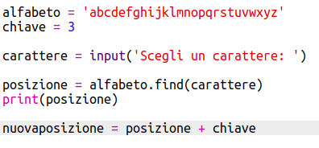
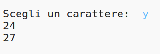

## Crittografia delle lettere

Scriviamo un programma Python per crittografare un singolo carattere dell'alfabeto.

+ Apri un modello vuoto di Python su Trinket: <a href="http://jumpto.cc/python-new" target="_blank">jumpto.cc/python-new</a>.

+ Invece di disegnare l'alfabeto in un cerchio, scriviamolo come variabile `alfabeto`.
    
    

+ Ogni lettera dell'alfabeto ha una posizione, a partire dalla posizione 0. Quindi la lettera 'a' è nella posizione 0 dell'alfabeto, e la lettera 'c' è in posizione 2.
    
    

+ Puoi ottenere una lettera dalla tua variabile `alfabeto` scrivendo la posizione tra parentesi quadre.
    
    
    
    È possibile eliminare l'istruzione `print` una volta che hai provato questo.

+ Successivamente, dovrai memorizzare la `chiave segreta` in una variabile.
    
    

+ Quindi, chiedere all'utente una singola lettera (chiamata `carattere`) da crittografare.
    
    

+ Trova la `posizione` del `carattere`.
    
    

+ È possibile verificare la `posizione memorizzata` stampandolo. Ad esempio, quel carattere 'e' è in posizione 4 dell'alfabeto.
    
    

+ Per crittografare il `carattere`, dovresti sommare `la chiave` alla sua `posizione`. Questo viene quindi memorizzato in una variabile denominata `nuovaposizione` variabile.
    
    

+ Aggiungi del codice per visualizzare la posizione del nuovo carattere.
    
    

+ Prova il tuo nuovo codice. Poichè la tua `chiave` è 3, dovrebbe aggiungere 3 alla `posizione` e salvare il valore nella tua variabile `nuovaposizione`.
    
    Ad esempio, la lettera 'e' è in posizione 4. Per crittografare, si aggiunge la `chiave` (3) ottenendo 7.
    
    

+ Cosa succede quando provi a crittografare la lettera "y"?
    
    
    
    Nota che la `nuovaposizione` vale 27, ma non ci sono 27 lettere nell'alfabeto!

+ Puoi usare l'operatore modulo `%` per dire alla nuova posizione di tornare alla posizione 0 una volta raggiunta la posizione 26.
    
    

+ Finally, you want to print the letter at the new position.
    
    For example, adding the key to the letter 'e' gives 7, and the letter at position 7 of the alphabet is 'h'.
    
    

+ Try out your code. You can also remove some of your print statements, just printing the new character at the end.
    
    