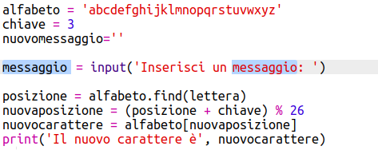

## Crittografare interi messaggi

Invece di crittografare e decrittografare i messaggi un solo carattere alla volta, modifichiamo il programma per crittografare interi messaggi!

+ Innanzitutto, controlla che il tuo codice assomigli a questo:
    
    

+ Creare una variabile per memorizzare il nuovo messaggio crittografato.
    
    

+ Cambia il tuo codice per memorizzare un'intero messaggio dell'utente e non un solo carattere.
    
    

+ Aggiungi un ciclo `for` al tuo codice e rientra (indentazione) il resto del codice in modo che venga ripetuto per ogni lettera del messaggio.
    
    

+ Prova il tuo codice. Dovresti vedere che ogni carattere nel messaggio è crittografato e stampato uno alla volta.
    
    

+ Aggiungiamo ogni carattere crittografato alla tua variabile `nuovomessaggio`.
    
    

+ Puoi stampare con`print` il `nuovomessaggio` crittografato.
    
    

+ Se elimini gli spazi prima della ` stampa ` dichiarazione, il messaggio crittografato verrà visualizzato solo una volta alla fine. Puoi anche cancellare il codice che stampa le posizioni dei caratteri.
    
    