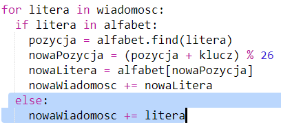

## Dodatkowe litery

Niektórych znaków nie ma w alfabecie, co powoduje błąd.

+ Przetestuj swój kod za pomocą znaków, których nie ma w alfabecie.
    
    Na przykład, możesz użyć wiadomości `cześć!!`.
    
    
    
    Zauważ, że spacja i znak `!` są zaszyfrowane jako litera 'c'!

+ Aby to naprawić, szyfrujesz tylko te litery, które są w alfabecie. Aby to zrobić, dodaj polecenie `if` do swojego kodu i dodaj wcięcie do reszty kodu.
    
    

+ Przetestuj swój kod z tą samą wiadomością. Co się dzieje tym razem?
    
    
    
    Teraz twój kod po prostu pomija każdą literę, jeśli nie ma jej w alfabecie.

+ Byłoby lepiej, gdyby twój kod nie szyfrował znaków, które nie znajdują się w alfabecie, a w zamian wyświetlił je takimi, jakie są.
    
    Dodaj polecenie `else`, które będzie dodawać znaki w oryginalnej postaci do zaszyfrowanej wiadomości.
    
    

+ Przetestuj swój kod. Każda litera z alfabetu powinna być zaszyfrowana, a wszystkie inne znaki powinny pozostać takie same!
    
    